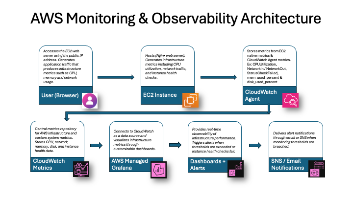
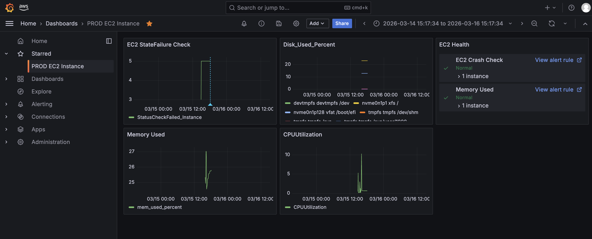
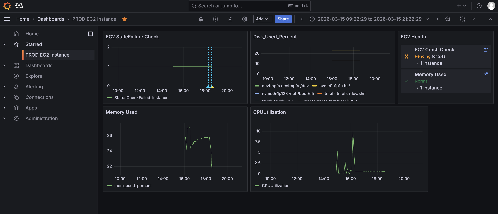

# AWS Monitoring & Observability Architecture

- This project demonstrates an AWS infrastructure monitoring solution using **Amazon Managed Grafana and AWS CloudWatch**.  
- A monitoring dashboard was built to visualize key EC2 metrics including **CPU utilization, Disk utilization, Memory usage and Instance health status checks with Alerts widgets.**
- The solution integrates AWS native monitoring services with Grafana dashboards to provide centralized visibility into system performance and health.
- The basic infrastructure involving VPC, Public Subnet, Internet Gateway and EC2 instance has been procured through terraform.
---

## Architecture

The monitoring solution integrates AWS CloudWatch metrics with Amazon Managed Grafana to visualize infrastructure health and performance.

---

## Components Included

- EC2 Instance - Nginix server being monitored 
- CloudWatch Agent - Collects system-level metrics such as memory and disk 
- Amazon CloudWatch - Stores infrastructure and custom metrics 
- Amazon Managed Grafana - Visualization/dashboard & alert creation
- SNS/Email Notification - alert notifications through email or SNS
---

## System-Level Metrics (CloudWatch Agent)

Using **CloudWatch Agent**, additional operating system metrics were collected. These metrics are published under the **CWAgent namespace** in CloudWatch.

- Memory Usage
- Disk Utilization
- Filesystem usage

---

## Custom dashboards were created to display:

- CPU utilization 
- Memory usage
- Instance health check
- Disk usage
- Widget for Alerts section

---

### Grafana Alerting
Alert rules were configured in Grafana to detect infrastructure anomalies based on CloudWatch metrics and trigger alerts when thresholds are exceeded.
Once triggered,, gets deliver through email or SNS.
---

